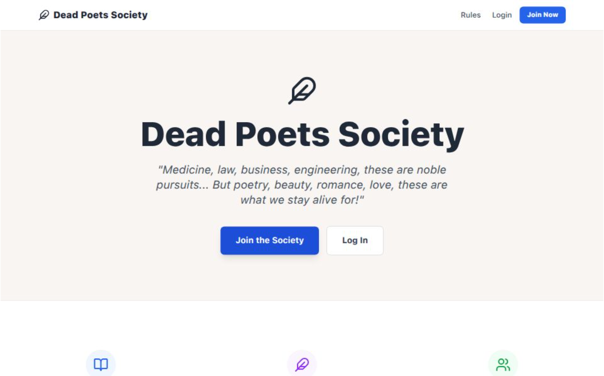

#  Dead Poets Society

A full-stack social platform for poetry enthusiasts. Users can write, share, and review poems.
> ** Note:** This platform is actively under development. New features and improvements are being added regularly to enhance the user experience and expand functionality.


**[Live Demo](https://dead-poets-society-one.vercel.app/)**



---


##  Tech Stack

**Frontend:** React.js, Tailwind CSS, Axios  
**Backend:** Node.js, Express.js, MongoDB, Mongoose  
**Auth:** Passport.js, Express-Session, bcrypt, HTTP-Only Cookies  
**Deployment:** Vercel (Frontend & Backend), MongoDB Atlas

---

##  Features

###  Authentication & Security
- **Secure Sign Up & Login** - Password encryption with bcrypt
- **Session Management** - HTTP-only cookies with MongoDB session store
- **Secure Logout** - Session destruction and cookie cleanup

###  Poetry Management
- **Create & Publish Poems** - Clean, distraction-free writing interface
- **Poetry Feed** - Browse and discover poems
- **Favorites Collection** - Bookmark poems for quick access later

###  Profile Customization
- **Personalize Identity** - Update username and write a bio
- **User Dashboard** - View your profile and published works

###  Community Engagement
- **Anonymous Reviews** - Pressure-free feedback system for constructive critique
- **Focus on Art** - Single-level comments without threaded debates

###  AI-Powered Features
- **AI Poetry Critique** - Get thoughtful analysis and deeper meaning interpretations
- **Creative Feedback** - AI-generated insights to help writers improve

###  Desktop-Optimized Experience
- **Immersive Reading** - Typography and layout designed for laptops and desktops
- **Spacious Interface** - Book-like reading experience with typewriter aesthetics

---

##  Technical Challenges & Solutions

### Challenge: Cross-Domain Session Management in Serverless

**The Problem:**  
Deploying frontend and backend on separate Vercel domains caused browsers to reject session cookies due to CORS policies and `SameSite` restrictions. Additionally, serverless functions would cold-start and lose database connections.

**The Solution:**

1. **Cross-Domain Secure Cookies**  
   Configured `SameSite: 'none'` with `Secure: true` to allow credentials across different domains:
```javascript
   cookie: {
     secure: true,           // HTTPS only
     httpOnly: true,         // Prevents XSS attacks
     sameSite: 'none',       // Cross-site cookies
     maxAge: 7 * 24 * 60 * 60 * 1000  // 7 days
   }
```

2. **Vercel API Proxying**  
   Used Vercel rewrites to route API requests through the same origin, bypassing CORS:
```json
   {
     "rewrites": [
       { "source": "/api/:path*", "destination": "https://backend.vercel.app/api/:path*" }
     ]
   }
```

3. **MongoDB Connection Caching**  
   Implemented connection pooling at module scope to prevent timeouts:
```javascript
   let cachedDb = null;

   async function connectToDatabase() {
     if (cachedDb) return cachedDb;
     cachedDb = await mongoose.connect(process.env.MONGO_URI, {
       maxPoolSize: 10,
       serverSelectionTimeoutMS: 5000
     });
     return cachedDb;
   }
```

**Result:** Achieved persistent sessions across serverless deployments with sub-100ms response times.

---

##  Getting Started

### Prerequisites
- Node.js v14+
- MongoDB Atlas account

### Installation
```bash
# Clone the repository
git clone https://github.com/Leela0o5/Dead-Poets-Society.git
cd Dead-Poets-Society

# Install backend dependencies
cd backend
npm install

# Install frontend dependencies
cd ../frontend
npm install
```

### Environment Setup

Create `.env` in the `backend` folder:
```env
MONGO_URI=your_mongodb_connection_string
SESSION_SECRET=your_secret_key
JWT_SECRET=your_secret_key
PORT=5000
OPENAI_API_KEY=your_api_key
CLIENT_URL=http://localhost:3000
NODE_ENV=development
```

### Run Locally
```bash
# Terminal 1 - Start backend server (port 5000)
cd backend
node server.js

# Terminal 2 - Start frontend (port 3000)
cd frontend
npm start
```

Visit `http://localhost:3000` in your browser.

---

##  Project Structure
```
dead-poets-society/
├── frontend/              # React application
│   ├── src/
│   │   ├── components/   # Reusable UI components
│   │   ├── pages/        # Route-based page components
│   │   ├── context/      # Auth and state management
│   │   └── utils/        # API helpers and utilities
│   └── package.json
├── backend/               # Express API server
│   ├── models/           # Mongoose schemas
│   ├── routes/           # API endpoints
│   ├── middleware/       # Auth and validation
│   └── package.json
└── README.md
```

---

##  Deployment Architecture

- **Frontend**: Static React build deployed to Vercel edge network
- **Backend**: Express app running as Vercel serverless functions
- **Database**: MongoDB Atlas with automated backups and replica sets
- **Sessions**: Persistent storage in MongoDB via connect-mongo

---

##  Key Learnings

- Navigated the complexities of **serverless session management** across multiple domains
- Implemented **production-grade security** with HTTP-only cookies and CSRF protection
- Optimized **database connections** for ephemeral serverless environments
- Built a **scalable full-stack application** with separation of concerns

---
### MIT License
```
MIT License

Copyright (c) 2025 Leela

Permission is hereby granted, free of charge, to any person obtaining a copy
of this software and associated documentation files (the "Software"), to deal
in the Software without restriction, including without limitation the rights
to use, copy, modify, merge, publish, distribute, sublicense, and/or sell
copies of the Software, and to permit persons to whom the Software is
furnished to do so, subject to the following conditions:

The above copyright notice and this permission notice shall be included in all
copies or substantial portions of the Software.

THE SOFTWARE IS PROVIDED "AS IS", WITHOUT WARRANTY OF ANY KIND, EXPRESS OR
IMPLIED, INCLUDING BUT NOT LIMITED TO THE WARRANTIES OF MERCHANTABILITY,
FITNESS FOR A PARTICULAR PURPOSE AND NONINFRINGEMENT. IN NO EVENT SHALL THE
AUTHORS OR COPYRIGHT HOLDERS BE LIABLE FOR ANY CLAIM, DAMAGES OR OTHER
LIABILITY, WHETHER IN AN ACTION OF CONTRACT, TORT OR OTHERWISE, ARISING FROM,
OUT OF OR IN CONNECTION WITH THE SOFTWARE OR THE USE OR OTHER DEALINGS IN THE
SOFTWARE.
```

---

##  Author

**Leela Mahalakshmi M**

---

<div align="center">

Made with ❤️. See ya:)

*"We don't read and write poetry because it's cute. We read and write poetry because we are members of the human race."*

</div>
